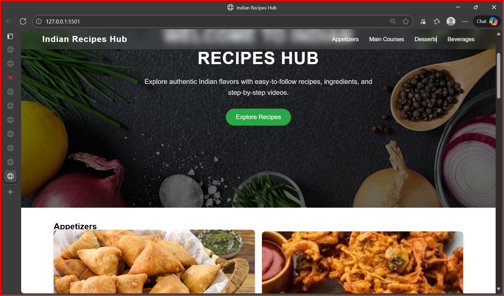
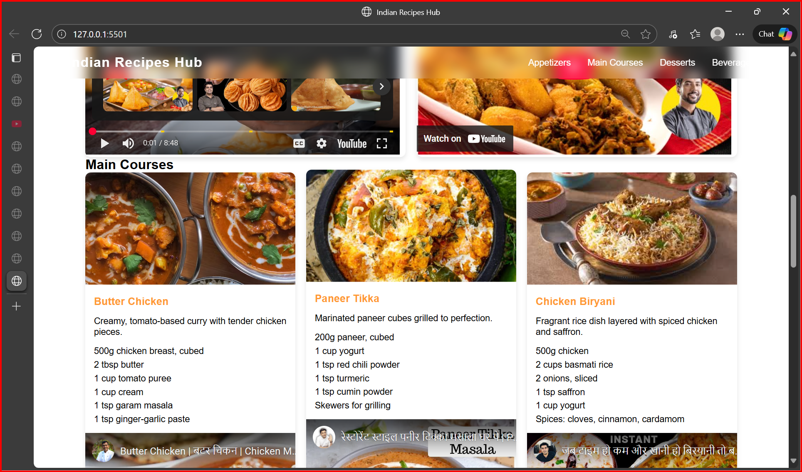

# MY_recipe_page# 🍴 Indian Recipes Hub

*Indian Recipes Hub* is a modern and responsive frontend website built using *HTML, **CSS, and **JavaScript*.  
It showcases authentic Indian dishes with elegant design, animations, and a smooth user interface.

---

## 🌟 Features

- 🧭 Stylish *Navbar* with glassmorphism and hover underline effect  
- 🎨 *Animated Hero Section* with background image overlay  
- 🍛 Organized recipe categories (Appetizers, Main Courses, Desserts, Beverages)  
- 💫 Smooth text and button animations  
- 📱 *Fully responsive* across desktop and mobile screens  

---

## 🖼 Screenshots

### 🏠 Home Section

### 🍕 Appetizers Section

> 💡 Tip: Save your screenshots inside a folder named screenshots in your project directory.

---

## 🧱 Tech Stack

| Component | Technology |
|------------|-------------|
| Structure | HTML5 |
| Styling | CSS3 (Animations, Flexbox, Gradient, Glassmorphism) |
| Interactivity | JavaScript (Basic DOM and animations) |

---

## 📂 Project Structure
